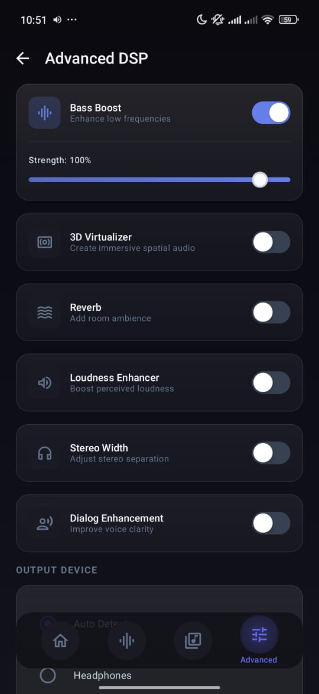
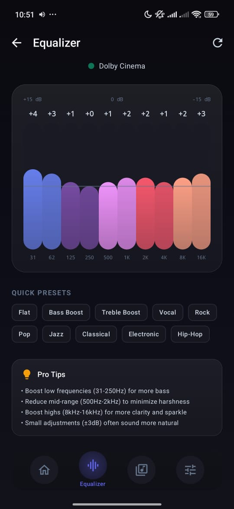
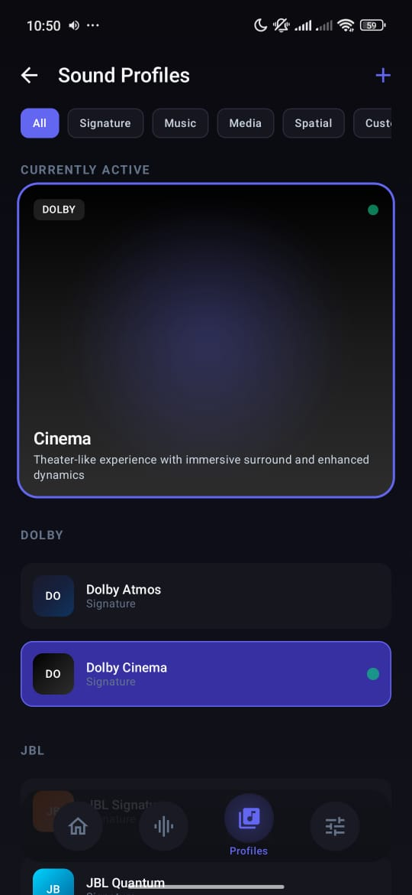
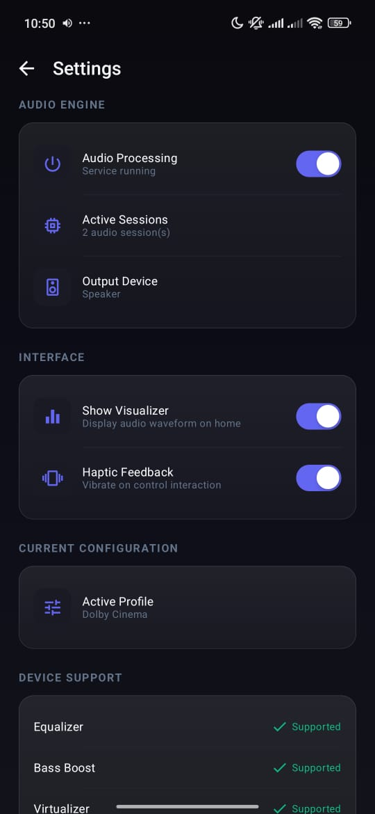
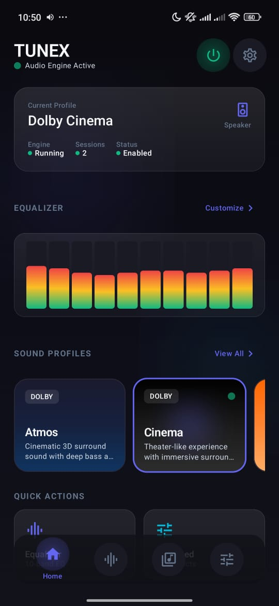

# Tunex

A system-wide audio equalizer for Android. No root required.


## What is this?

Tunex is an equalizer app that works across all audio on your device. It uses Android's AudioEffect API to apply EQ and DSP effects to any app playing audio.

**Features:**
- 10-band parametric equalizer (-15dB to +15dB)
- Sound profiles (Dolby-style, JBL, Sony, etc.)
- Bass boost, virtualizer, reverb
- Loudness enhancer
- Stereo width control
- Works in background as a service
- Dark theme UI

## Screenshots

<p align="center">
  
  
  
</p>
<p align="center">
  
  
</p>

## Requirements

- Android 10 (API 29) or higher
- No root needed

## Building

Clone the repo and open in Android Studio:

```bash
git clone https://github.com/Bytegarden-X/tunex.git
cd tunex
```

Build debug APK:
```bash
./gradlew assembleDebug
```

APK will be in `app/build/outputs/apk/debug/`

## Project Structure

```
app/src/main/java/com/tunex/
├── audio/
│   ├── engine/          # AudioEffect wrappers
│   └── service/         # Background processing service
├── data/
│   ├── model/           # Data classes
│   └── repository/      # DataStore persistence
├── receiver/            # Boot & audio session receivers  
└── ui/
    ├── components/      # Reusable Compose components
    ├── screens/         # App screens
    ├── navigation/      # Nav setup
    ├── theme/           # Colors, typography, shapes
    └── viewmodel/       # State management
```

## How it works

1. App starts a foreground service that listens for audio sessions
2. When any app starts playing audio, we attach our effects to that session
3. EQ, bass boost, virtualizer, reverb get applied in real-time
4. Settings are persisted using DataStore

The "brand profiles" (Dolby, JBL, etc.) are just EQ presets that try to match the sound signature of those brands. We don't use any proprietary algorithms.

## Bugs fixed in this copy

- **Broken session attachment**: `AudioEffectReceiver` correctly received the
  broadcast from cooperating media apps and forwarded the real session ID to
  `AudioProcessingService`, but `onStartCommand` never handled those actions
  (`ATTACH_SESSION`/`DETACH_SESSION`) - the session ID was silently dropped
  and no effect was ever attached. Now wired up in `attachSession()` /
  `detachSession()`.
- **Fake session IDs**: `AudioSessionManager` was using `config.hashCode()`
  as a stand-in for a real audio session ID. The real
  `AudioPlaybackConfiguration.getSessionId()` is a hidden `@SystemApi` -
  third-party apps can't call it - so that value was never usable for
  attaching effects. `AudioSessionManager` is now used only to show "N apps
  playing" in the UI; it no longer tries to attach effects with the fake ID.
- **New EQ settings not reaching new sessions**: adjusting individual bands
  (as opposed to picking a named profile) didn't update what got applied to
  a newly-opened session. `currentBands` is now tracked and applied to every
  session as it opens.
- Added a context-registered receiver directly in the service (in addition
  to the manifest-declared one) since Android 8+ doesn't reliably deliver
  implicit broadcasts to manifest receivers.

No special ADB permission grants are needed for this app's core mechanism -
it only uses the standard broadcast + `MODIFY_AUDIO_SETTINGS`/
`POST_NOTIFICATIONS`, both requested normally in-app.

## Building via GitHub Actions (no local Android Studio needed)

1. Push this folder to a GitHub repo (drag-and-drop upload works fine).
2. Go to the **Actions** tab - a build starts automatically on push, or use
   **Run workflow**.
3. Once green, open the run, download the **tunex-debug** artifact under
   **Artifacts** - it's a zip containing the APK(s).
4. Transfer to your phone and install.

## Important limitation: YouTube will not work

This app (like every non-root equalizer app, including the best-in-class
ones) relies on apps voluntarily broadcasting their audio session ID.
YouTube creates a session but does not broadcast it, so no session-based
equalizer - this one included - can affect it. This isn't a bug we can fix
here; it would require capturing system audio output instead (a different,
more complex approach with its own trade-offs).

## Advanced Player Tracking (experimental, added in this copy)

A new "Advanced Player Tracking" section in the Advanced screen adds a
second, best-effort way to find sessions - on top of, not instead of, the
global-session-0 and broadcast-based tracking that already covers most
apps. It combines:

- **DUMP permission** (ADB-only: `adb shell pm grant <package>
  android.permission.DUMP`) - lets `DumpSessionScanner` read AudioFlinger's
  internal debug dump and pull out session IDs for apps that don't
  broadcast (Spotify, YouTube Music).
- **Notification access** (Settings toggle, not ADB) - `TunexNotificationListener`
  notices when a media player's notification appears/changes and triggers
  an immediate rescan, backed by a periodic scan every 10s regardless.

Off by default - toggle it on in Advanced once both permissions show
granted. **Read the caveat in `DumpSessionScanner.kt`**: this reaches into
an undocumented, hidden system API and parses human-readable debug text,
not a stable interface. It's wrapped defensively so a failure here can't
affect anything that already works (global session 0, broadcast tracking) -
worst case it just doesn't find extra sessions on some devices/Android
versions.

## Known Issues

- Some apps with their own audio processing might conflict
- Bluetooth latency can vary by device
- Samsung devices sometimes need audio restart to apply effects

## Contributing

PRs welcome. Please test on a real device before submitting.

## License

GPL v3 - see [LICENSE](LICENSE) file.

Free to use, modify, and distribute. If you fork this, keep it open source.

---

Made by [@Bytegarden-X](https://github.com/Bytegarden-X)
